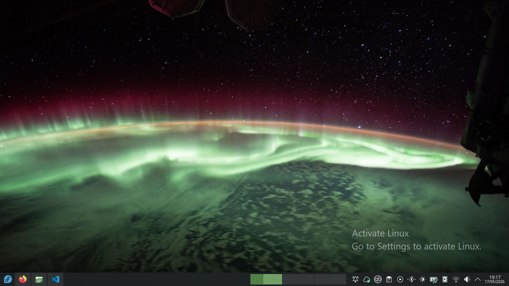

# Activate Linux Plasmoid

- Plasma Minimum Version: 6.0



## Test from code


You need to install the `plasma-sdk` package on your distribution.
``` bash
plasmoidviewer -a ./com.zicstardust.activatelinux
```